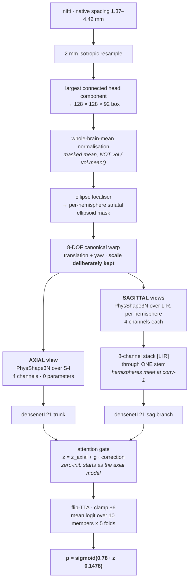

# DaT SPECT — abnormality classification

Classifies a dopamine-transporter (DaT) SPECT brain scan as normal or abnormal, from the scan alone.

Built for DrivenData competition 311 (*DaT Parkinson's Challenge*, closed 2026-09-16, **1,009
entrants**). **Final standing: 6th place**, private log loss 0.2732, AUC 0.9489.

| # | team | private log loss | AUC |
|---|---|---|---|
| 1 | TheAvengers | 0.2532 | 0.9590 |
| 2 | Tigertech | 0.2647 | 0.9522 |
| 3 | Shivom | 0.2708 | 0.9491 |
| 4 | Suyash92 | 0.2727 | 0.9488 |
| 5 | NavAttack | 0.2731 | 0.9524 |
| **6** | **this repository** | **0.2732** | **0.9489** |

Note the margins: 5th place is 0.0001 ahead and 4th is 0.0005 ahead. Three places rest on less than a
thousandth of log loss, which is roughly a tenth of the run-to-run noise between two different models
on a set this size. What that means for reading any of the numbers below is discussed under
[the temperature ladder](#1-the-temperature-ladder).

This repository is the cleaned residue of that work: the model that won that place, the code that
reproduces it, and the reasoning worth keeping. Roughly four hundred exploratory scripts, twenty-odd
refuted research arms and a superseded pipeline have been left behind. What survives is what reproduces.

---

## The problem

A DaT scan images dopamine transporter density in the striatum. A **normal** study shows two symmetric
comma-shaped striata with intact putaminal tails. An **abnormal** study shows dot-shaped striata, tails
lost, often asymmetric — the imaging signature of a parkinsonian syndrome.

The data are 1,362 scans from ten French hospitals, 615 normal and 747 abnormal, across eight
acquisition clusters with voxel spacing from 1.37 to 4.42 mm. The salivary glands are a bright
inferior confounder: in a quarter of abnormal scans they, not the striatum, set the global maximum.


*The task, as the network sees it. Left column is the canonical box; the four to its right are the
channels the projection produces. The normal scan shows two symmetric commas with intact tails; the
abnormal shows dots with the tails gone. The bright blobs lateral to the striatum in the abnormal row
are the salivary glands, which set the global maximum in a quarter of abnormal scans — the reason the
channels are normalised inside the striatal region rather than globally. Rendered by
`build/make_figures.py` from the real trained model; the example scans are chosen by the model's own
out-of-fold logit, not by eye.*

Two facts shaped every design decision:

- The point spread function is about 9 mm full width at half maximum, so at 2 mm sampling the images
  are roughly twice oversampled. There is less information in a voxel than its size suggests.
- The label is a **clinician's read**, not dopaminergic ground truth. That ceiling is measured at the
  end, and it is lower than it looks.

---

## Approach

The pipeline reduces each 3D scan to a small stack of physically-meaningful 2D maps and reads those
with an ordinary 2D convolutional network. Three-dimensional readers were tested at power and lost by
a wide margin: a full-box 3D network cost 0.043 log loss, a striatal-crop 3D network 0.035, both
across three seeds. The projection is not a compromise, it is the better representation on this data.




*The five preprocessing stages on one abnormal scan, as axial maximum-intensity projections. Stages 3
and 4 look alike because each panel is independently display-scaled; the normalisation changes the
values, not the appearance. The cyan contour in stage 5 is the localiser's striatal ellipsoid.*

**The projection** (`datscan/projection.py`, `PhysShape3N`) reduces the S-I axis to four channels:
peak uptake, mean uptake, anisotropy × uptake, and a normalised-displacement-tail channel. It holds
**zero learnable parameters**. An earlier learnable version collapsed to rank 1.7 of 5, so the
learnable form was buying nothing; the fixed physical form is what remains. The one live scalar,
`tau = 4.090·mu + 1.259`, is set per scan from the scan's own mean.

**The fusion** (`sagfuse=attnres`) stacks the left and right sagittal views as eight channels through
one stem, so the two hemispheres meet at the first convolution. Deferring that comparison to any later
layer loses: a mid-level Siamese variant cost 0.0056. The eight-channel stack *is* a mirror-aligned
conv-1 Siamese, and it is where the asymmetry signal lives.

**Scale is never normalised.** Striatal length alone reaches 0.89 AUC. Normalising every striatum to a
common size would delete exactly that.


*Everything the trunk receives, for a confident normal, a confident abnormal and a mild abnormal. The
four axial channels are on the left; the sagittal views on the right are half-brains, one per
hemisphere, and it is their comparison at the first convolution that carries the asymmetry signal.
`p` is the winning model's own calibrated prediction for that scan. The mild case in the bottom row is
the interesting one: its axial channels look much closer to the normal than to the florid abnormal,
and it is scans like this that carry most of the loss.*

---

## The model that won

**`recipes/fusion10_s078.json`** — 10 members × 5 folds, calibrated at slope **0.78**.

```bash
bash recipes/train_fusion10.sh                                    # 50 folds
python build/export_members.py  --recipe recipes/fusion10_s078.json --runs <runs> --out <assets>
python build/calibrate.py       --recipe recipes/fusion10_s078.json --runs <runs>
python build/build_roster.py    --recipe recipes/fusion10_s078.json --assets <assets> \
                                --runs <runs> --slope 0.78 --out submission.zip
```

Three configurations were submitted. They are kept here because the differences between them are the
most useful thing in the repository.

| recipe | members | out-of-fold ll | public ll | **private ll** |
|---|---|---|---|---|
| **`fusion10_s078`** | 10 | 0.2067 | 0.2317 | **0.2732 — 6th place** |
| `fusion10` | 10 | 0.2023 | **0.2313** | 0.2754 |
| `pms14` | 14 | **0.2016** | 0.2353 | 0.2838 |

Read that table by column. **Each column picks a different winner, and the leftmost two both pick the
wrong one.** The best out-of-fold model was the worst of the three on the private split. The best
public model lost to a variant that differs from it in one number.

`fusion10_s078` and `fusion10` are the *same ten members with the same weights* — verified, the two
shipped packages contain the same fifty traces. They differ only in the calibration slope.

`pms14` adds a *premasked sagittal* construction, where the midline cut separating the hemispheres
happens before the geometric augmentation rather than after, so each hemisphere copy is anatomically
correct instead of cut in the warped frame. Four flags: `sagfuse_premask`, `premask_band=26`,
`premask_jitter=4`, `lesion_pre_geom`. It was better locally and worse on both test splits.

---

## The two results worth taking away

### 1. The temperature ladder

The optimal calibration slope falls monotonically as the evaluation set moves away from the training
distribution. Same roster throughout:

| evaluation set | optimal slope | knowable when? |
|---|---|---|
| out-of-fold, 1,362 training scans | 1.036 | offline |
| public test split | ~0.85 | during the competition |
| private test split | ~0.74 | only after the close |

Out-of-fold overstated the slope by about 0.30 and the public board by about 0.11. The mechanism: a
harder set makes confident predictions wrong more often, and flattening the logits buys that back.
Nothing local can see it, because locally the model is not wrong as often.

We shipped 0.85 and 0.78. The flatter one scored **0.0004 worse in public**, was written off, and then
won the private split by 0.0022 — it is the score we finished on. The estimated private optimum of 0.74
would have gained a further 0.0004, and 5th place was 0.0001 ahead of us.

**So: never fix the slope at the in-distribution optimum, and never retire a flatter variant on one
public delta.** Ship a bracket. The premium is ten-thousandths on the easy split; the payout is
thousandths on the hard one. `build/calibrate.py` prints the bracket and this table.

The opposite-direction half of the rule: **read `opt_temp` before fixing any slope.** If a change moves
the logit *scale*, a fixed slope ships the package cold — one variant had an optimal temperature of
1.22 against 1.04 for the baseline and scored 0.2618. A fixed slope only compares packages whose logit
spread matches, so `calibrate.py` prints both.

### 2. Distance from a working package predicts the board; local quality does not

Writing `rho` for the class-centered correlation between a candidate's out-of-fold logits and those of
a package that already has a score:

```
board log loss  ≈  0.2313 + 0.452 · (1 − rho)
```

`pms14` sat at rho = 0.9900, giving 0.2358. It scored 0.2353 in public, and it lost on the private
split too. Every other instrument built during the competition was wrong by more: a recon-fragility
measure ranked the least fragile package worst, an external-dataset check went nought for two,
leave-one-cluster-out mis-ranked twice, and out-of-fold log loss correlated with the board at +0.48
over ten reconstructed packages — the right sign, but weaker than predicting the mean.

**Once a package scores well, growing the roster within the same family is not a conservative move.**
Four extra same-recipe members moved rho to 0.99 and cost 0.004 in public, 0.011 in private.

### The shake-up, for calibration of your own expectations

The private split destroyed the public ordering. Public 1st fell to 28th, public 12th rose to 2nd, and
a team whose public AUC beat everyone in the top nine fell to 38th. We moved 7th to 6th.

| team | public | private | move |
|---|---|---|---|
| Marc-Dvci | 1st, 0.2154 | 28th, 0.2931 | −27 |
| TheAvengers | 2nd, 0.2249 | **1st**, 0.2532 | +1 |
| South-Wing | 3rd, 0.2263 | 17th, 0.2848 | −14 |
| **this repo** | **7th, 0.2313** | **6th, 0.2732** | **+1** |
| venkt | 10th, 0.2340 | 38th, 0.2971 | −28 |
| Tigertech | 12th, 0.2363 | **2nd**, 0.2647 | +10 |

This was predictable in kind, if not in detail. For two genuinely different models here, per-scan
losses correlate around 0.79, so at 1,300 scans the standard deviation of the gap between them is about
0.009 — while the entire public top twelve was spread over 0.021. Mid-table public ordering was mostly
sampling noise. Every package also lost 0.035 to 0.050 crossing to the private split, uniformly across
recipes, so the population-transfer term was real and recipe-independent.

---

## Reproducing

Environment: Python 3.12, PyTorch 2.10, MONAI 1.6 (build-time only — the submission ships TorchScript
and needs just torch, numpy, scipy, nibabel, pandas).

```bash
# 1. caches: nifti -> canonical boxes + striatal masks (about 40 min on one GPU)
python build/build_canonv2_cache.py --niftis /path/to/niftis --out /path/to/boxcache

#    the gate this repo was assembled under -- rebuild a few scans and correlate:
python build/build_canonv2_cache.py --limit 12 --verify /path/to/boxcache/canonv2.f16.npy
#    -> VERIFY n=12 | corr: min 1.0000 median 1.0000   PASS

# 2. train (about 2 h 15 per fold; the launcher fills idle GPUs and is restartable)
bash recipes/train_fusion10.sh          # 50 folds -> the winning model
bash recipes/train_pms14.sh             # 70 folds -> the variant, for comparison

# 3. export to TorchScript, then verify on scans the tracer never saw
python build/export_members.py --recipe recipes/fusion10_s078.json --runs <runs> --out <assets>
python build/verify_traces.py <assets> <runs>
#    -> TRACECHECK 50 fold-models on 16 held-out scans | worst CPU 0.00e+00 | PASS

# 4. calibrate: print the slope bracket before choosing one
python build/calibrate.py --recipe recipes/fusion10_s078.json --runs <runs>

# 5. package, then verify from a FRESH UNZIP (never from the staging directory)
python build/build_roster.py --recipe recipes/fusion10_s078.json --assets <assets> \
       --runs <runs> --slope 0.78 --out /path/submission.zip
bash build/verify_pkg.sh /path/submission.zip

# 6. gates
python tests/run_all.py

# 7. figures (regenerates everything in docs/figures/ from the real model)
python build/make_figures.py
```

Inference, which is what the submission runs:

```bash
DATA_DIR=/path/with/niftis OUTPUT_PATH=/tmp/submission.csv python inference/main.py
```

---

## Layout

| path | contents |
|---|---|
| `datscan/` | the engine: config, projection, model, data, transforms, lesion synthesis, trainer, export |
| `inference/` | what ships inside the zip: `main.py`, the preprocessing chain, the ellipse localiser |
| `recipes/` | the three submitted configurations, pinned, plus their training launchers |
| `build/` | cache builder, TorchScript export, trace verification, calibration, roster packaging |
| `meta/` | labels, uids, acquisition metadata, and the cross-validation partitions the members used |
| `tests/` | the numerical gates, including reproduction of the winning calibration |
| `notes/` | the design spec, and every refuted arm with its verdict |
| `docs/figures/` | the README figures, regenerated by `build/make_figures.py` |

### A note on `datscan/config.py`

`Recipe` carries 171 fields. **The winning model uses 15 of them and `pms14` uses 18**; the rest are
defaults belonging to research arms that were measured and rejected. Stripping them would make the code
shorter and is deliberately not done: the shipped models are bit-exact products of this code, a
rewritten copy could only be shown equivalent by retraining, and the refuted settings are the evidence
that the surviving ones are a local optimum rather than an accident. `notes/REFUTED.md` records what
each one cost. The live flags are the ones named in `recipes/*.json`.

---

## Things that cost us, so they need not cost you

**Measurement**

- A screen needs at least three seeds. Per-fold seed noise is 0.005–0.009 log loss for densenet and
  0.02–0.07 for efficientnet-b0. Nothing below three sigma at full coverage is real.
- If two folds disagree in *sign* by more than about 0.010, their mean is not a summary. Three
  unrelated interventions produced exactly that pattern and a single-fold screen would have called all
  three winners.
- Any in-distribution gain of roughly 0.007 to 0.010 from changing the training distribution is the
  signature of fitting the acquisition mix harder, not of a better model. Three separate arms passed a
  clean leak-free screen and then failed out-of-cluster validation.
- Never select members, folds, or checkpoints on out-of-fold predictions. Selection inflation runs
  0.011 to 0.045 log loss and is family-dependent. Anything derived from out-of-fold predictions leaks
  about 0.018 AUC and needs nested validation.
- When an intervention rebuilds a quantity, the control is the same rebuild **without** the
  intervention, never a previously published number. Five verdicts were confounded this way.

**Export**

- Trace on CPU, then verify the CPU trace running on GPU, on **real scans**. Random input hides baked
  constants: `device=`, `.to(dtype)`, `.to(other)` and `torch.arange(device=)` all bake at trace time.
- `torch.jit.trace` shares parameter storage, so never call `.half()` on a live trace. Save the f32
  trace, reload from disk, then convert.
- Verify from a fresh unzip, never the staging directory.
- Model count is capped by the smoke-test time limit, not by upload size or the inference budget.

**The normalisation trap, which cost a retracted finding**

`datprep_iso.normalize()` is the mean over voxels above 0.15 × the 99.9th percentile, inside the brain
mask. Writing `vol / vol.mean()` instead produces an input the network has never seen: correlation
0.58 with the real pipeline on unperturbed scans, while every diagnostic looks healthy. A fragility
result was built on that mistake and had to be withdrawn. Any harness that re-implements preprocessing
must be correlated against the shipped path on unperturbed scans, and the bar is 0.95, not "it did not
crash".

---

## The ceiling

The label is one clinician's read, and we measured how reproducible that is.

Three rounds of blinded re-reading were run on our own training scans: anonymised renders, no labels,
no model output, shuffled order, confident normals mixed in as controls.

- On 14 of the model's most confident errors, the reader sided with the model against the stored label
  **9 times**.
- On 60 blinded reads the reader agreed with the stored label **39 times**. Among scans stored as
  normal, the reader called abnormal in 17 of 40.
- Re-shown the same 14 scans weeks later, the same reader changed their own answer on **4 of 14**.

None of this is a random sample — these are the scans the model found hardest, so the rates describe
the difficult tail, not the dataset. But the loss is concentrated in exactly that tail: 115 of 1,362
scans are misclassified and carry 57% of the total loss, and about 3% of scans carry a fifth of it.

Give that tail the entropy implied by a 29% self-disagreement rate and the irreducible contribution is
roughly 0.018 log loss. Assume the contested scans are true coin flips and it is 0.021. **The spread
from 1st to 10th on the private leaderboard was 0.023.** The label-noise floor is about as wide as the
entire competitive field, and everyone pays it, so it separates nobody. What separates entrants is the
confidence penalty stacked on top — which is exactly why the calibration slope decided this
competition and the architecture did not.

That excess is not headroom anyone can claim, and the reason is the most useful negative result here.
**Ensemble disagreement anti-predicts our errors — the mistakes are unanimous.** A contested scan does
not look uncertain to the models, it looks confidently wrong. Nothing built here beat the absolute
logit as an error detector, so those scans cannot be hedged without hedging the confident correct ones
and paying more than the saving.

---

## Licence and data

Code is the authors'. The scan data are not redistributed here and remain under the competition's
terms. The ellipse localiser shipped in `inference/assets/` was trained on 276 expert-drawn contours
from this dataset. No external DaT dataset was used for training at any point, as the competition
rules required.
